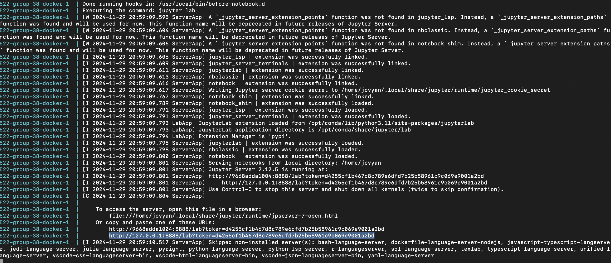

# Wine Quality Analysis

Authors: Abdul Safdar, Karlygash Zhakupbayeva, Tengwei Wang

## Summary

That data set that we used in this project can be found [here](https://archive.ics.uci.edu/dataset/186/wine+quality)). It consists of physicochemical properties from various wine samples. These features were obtained through rigorous testing and are used to assess the quality of wine.The primary goal of this analysis was to perform a binary classification to determine wine quality. Wine quality scores greater than 5 were labeled as 1 (good quality), while scores of 5 or less were labeled as 0 (not good quality). This approach simplifies the multi-class problem into a more straightforward binary classification task, facilitating the use of a decision tree classifier. We utilized a Decision Tree Classifier to model the relationship between the physicochemical properties and the binary quality rating. The model was fine-tuned through the optimization of the max_depth parameter, which controls the complexity of the decision tree. 

In our report, we fit a simple decision tree classifier model and evaluated the best max depth hyperparameter for our decision tree model. Our results indicated that the most important features in predicting wine quality were alcohol, sulphates and volatile acidity. The decision tree model provided a transparent method for understanding the complex interplay of factors that determine wine quality. The use of a binary classification system allowed for clear distinctions between good and poor-quality wines, making it accessible for both experts and casual consumers to appreciate the subtleties of wine evaluation. More information about the specific analysis and results can be found in the report linked below.

## Usage

To view this report, first clone this repository to your local machine using git clone. Follow the steps to run this project.

Install [Docker](https://www.docker.com/get-started).

IMPORTANT : Make sure Docker Desktop is running.

Then open terminal and run the following in the root of the repository in your terminal :

``` bash
docker compose up
```

Wait until docker finishing pulling and running the image. Copy and paste the url from output information, which is like "<http://127.0.0.1:8888/lab?token=xxxxxxxxxx>", into your web browser. An example of this link is provided below, and is highlighted.



To run the analysis, run the following commands by opening terminal and then run the following in the root of the repository in terminal in the virtual docker container.

``` bash
python scripts/download_and_extract.py --url "https://archive.ics.uci.edu/static/public/186/wine+quality.zip" --output_dir data/raw

python scripts/clean_and_split_data.py --input data/raw/winequality-red.csv --output_dir data/processed 

python scripts/eda.py \
    --raw-data=data/raw/winequality-red.csv \
    --training-data=data/processed/train_data.csv \
    --plot-to=results

python scripts/fit_and_evaluate.py \
    --training-data=data/processed/train_data.csv \
    --test-data=data/processed/test_data.csv \
    --plot-to=results

quarto render report/wine_quality_analysis.qmd --to html
```

To view the analysis once the analysis has rendered, navigate to the reports folder on the left. Click on wine_quality_analysis.html and then click on Trust HTML. You can now view the analysis report.

To stop and clean up the container, you would type Ctrl + C in the terminal where you entered docker compose up, and then type

``` bash
docker-compose rm
```

## Dependencies

-   `conda` (version 24.9.1 or higher)
-   `conda-lock` (version 2.5.7 or higher)
-   `jupyterlab` (version 4.2.4 or higher)
-   `mamba` (version 1.5.11 or higher)
-   Python and packages listed in [`environment.yaml`](environment.yaml)
-   [Docker](https://www.docker.com/get-started)

## Developer Notes

### Adding a new dependency for the project

1)  Working on a new branch, update the `environment.yaml` file.
2)  In terminal, enter `conda-lock -k explicit --file environment.yml -p linux-64` to rebuild the `conda-linux-64.lock` file.
3)  Rebuild the docker image in your local terminal. On a Mac enter : `docker build --platform=linux/amd64 --tag <name_of_test_image> .` On other OS : `docker build --tag <name_of_test_image> .` Note: these instructions will likely vary depending on your specific OS and chip.
4)  Update [`docker-compose.yml`](docker-compose.yml) file to use the newly built container image.
5)  Push your changes to GitHub.
6)  Open a pull request, to have your changes merged to the main branch.

## License

The project report is licensed under the Creative Commons Attribution-NonCommercial-NoDerivatives 4.0 International License. To view a copy of this license, visit <https://creativecommons.org/licenses/by-nc-nd/4.0/>, and the software in this repository is licensed under the MIT License. More information can be found in the LICENSE.md file in the repository.

## References

UCI Machine Learning Repository. Wine Quality Dataset. Available at: <https://archive.ics.uci.edu/ml/datasets/wine+quality>

Scikit-learn Documentation. Decision Trees. Available at: <https://scikit-learn.org/stable/modules/tree.html>

Kolhatkar, V. (2024). DSCI 571 Supervised Learning I Lecture 2 ML Fundamentals <https://pages.github.ubc.ca/mds-2024-25/DSCI_571_sup-learn-1_students/lectures/notes/02_ml-fundamentals.html>

Ostblom, J. (2024). DSCI 573 Feature and Model Selection, Lecture 1 Classification Metrics <https://pages.github.ubc.ca/mds-2024-25/DSCI_573_feat-model-select_students/lectures/01_classification-metrics.html>

VanderPlas, J., & Satyanarayan, A. (2018). Altair: Declarative Visualization in Python. <https://altair-viz.github.io/>
